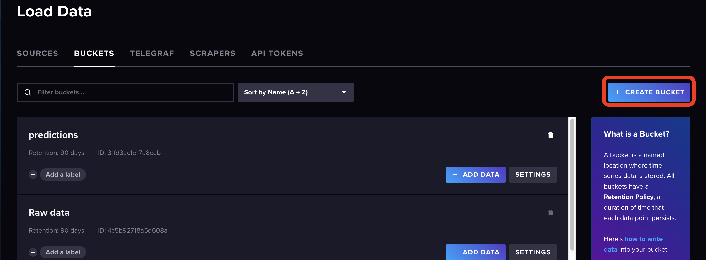
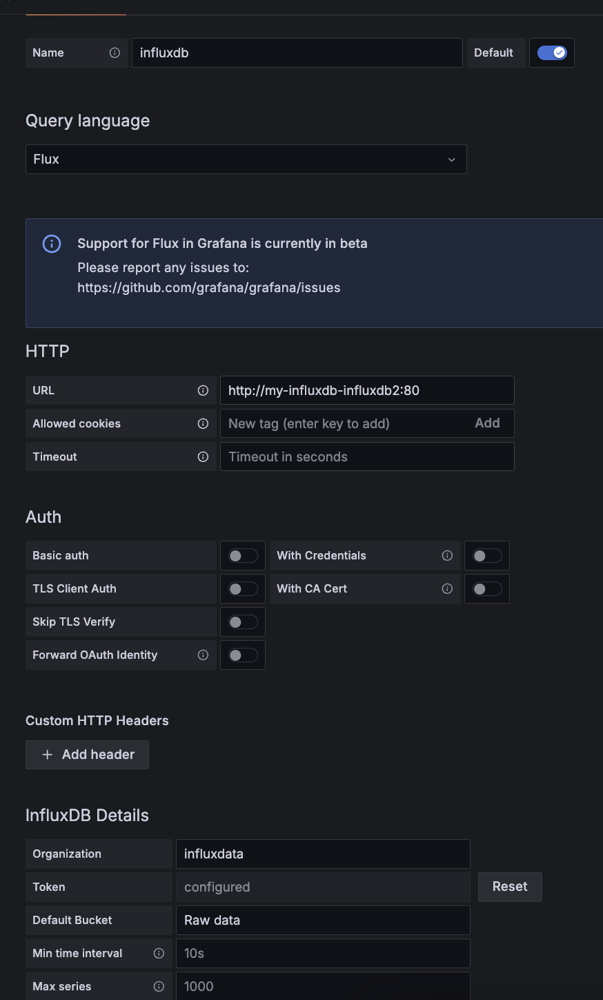

# Indice

- [Sobre este repositorio](#sobre-este-repositorio)
- [Introducción](#introducción)
- [Despliegue](#despliegue)
  - [Pre-requisitos](#pre-requisitos)
  - [Pasos para desplegar el proyecto](#pasos-para-desplegar-el-proyecto)

# Sobre este repositorio

En este repositorio se encuentra el proyecto final de master realizado por Raúl García Díaz ([raulgd@uoc.edu](mailto:raulgd@uoc.edu)).

# Introducción

La solución presentada trata sobre un caso practico de procesamiento de datos a tiempo real. Para ello se ha hecho uso de diferentes tecnologías:

- Redis: base de datos para tener en cache valores frecuentemente solicitados.
- Kafka: cola de mensajería, para el intercambio de mensajes a tiempo real.
- Flink: corazón del procesamiento de datos. Se encarga de realizar todo el procesado de los datos.
- InfluxDB: base de datos de series temporales. Ideal para el caso de uso de este proyecto.
- Grafana: aplicación para visualizar datos a tiempo real con dashboard customs.
- Kubernetes: plataforma donde se se ha desplegado el proyecto. Para un despliegue sencillo se ha hecho uso de **minikube**.
- Docker: solución de contenedor que se ha optado por usar debido a su uso tan amplio en la industria.

Por otro lado se han desarrollado aplicaciones para poder culminar con el proyecto:

- scraper: Aplicación desarrollada en python para obtener la información y enviarla en crudo a kafka.
- Collector: Flink no tiene una integración nativa con influxDB (conocidos como sinks), por lo que tuve que desarrollar un collector encargado de enviar los datos desde la cola de kafka con los datos procesado a influxDB.
- model-RNN: Código desarrollado en python para la creación de los modelos para la posterior predicción de los valores  de los sensores a futuro.
- app-predict: Aplicación que se encarga de cargar el modelo correspondiente al tipo de valor que se vaya a predecir para asi poder realizar una predicción y guardar esa predicción en influxDB.

# Despliegue

## Pre-requisitos

Para desplegar este proyecto se necesitan las siguientes herramientas:

- Docker
- Minikube
- kubectl

Para la creación del cluster *kubernetes*, se necesita como mínimo los siguientes recursos:

- 3 nodos.
- 6 Gi de memoria por nodo.
- 3 cores por nodo.
- 248 GB de almacenamiento en total.

```bash
$ minikube start --nodes 3 --memory 6144 --cpus 3
```

También se puede desplegar con solamente 1 nodo:

- 1 nodo.
- 18 Gi de memoria.
- 9 cores.
- 248 GB de almacenamiento en total.

```bash
$ minikube start --nodes 1 --memory 18432 --cpus 9
```

## Pasos para desplegar el proyecto

- Se crean las imágenes:
    ```bash
    $ docker build src/main/docker/flink-base/. -t pyflink-base:latest
    $ docker build src/main/docker/app-predict/. -t app-predict:1.0
    $ docker build src/main/docker/python-kafka-to-influxdb-raw/. -t python-kafka-to-influxdb-raw:1.0
    $ docker build src/main/docker/python-scraper/. -t python-scraper:1.0
    $ docker build src/main/docker/flink-split-measures/. -t pyflink-tfm-split-measures:1.0
   ```
- Se despliega kafka:
    ```bash
    $ helm install src/main/helm/strimzi-kafka-operator my-kakfa
    $ kubectl apply -f apply -f src/main/kubernetes/kafka/
    ```
- Se despliega flink, influxDB, prometheus y Redis:

  ```bash
    $ kubectl apply -f src/main/kubernetes/cert-manager
    $ helm install my-flink src/main/helm/flink-kubernetes-operator
    $ kubectl apply -f apply -f src/main/kubernetes/flink-application/
    $ helm install my-influxdb src/main/helm/influxdb2
    $ helm install my-redis src/main/helm/redis
    $ helm install my-prometheus kube-prometheus-stack
    $ kubectl apply -f apply -f src/main/kubernetes/pod-monitor
  ```

- Ahora de despliega el scraper:

  ```bash
  $ kubectl apply -f src/main/kubernetes/scraper
  ```
  El cronjob esta desactivado por defecto. Hay que desplegar varias veces de forma manual un job para asi poder guardar localizaciones en Redis. Una vez que haya guardado suficientes localizaciones como para que tarde menos de 10 minutos el job se puede reanudar el cronjob. Para reanudarlo hay que cambiar la etiqueta `suspend` a `false`. Para crear un job manual:
  ```bash
  $ kubectl create job --from cronjob/sensor-scapper my-manual-job
  ```

- Mietras se obtienen las localizaciones, se puede continuar con el despliegue. Ahora es necesario crear los buckets, cuyos nombres son:
  - *Raw data*
  - *predictions*
  
- Con los bucket creados, se puede ya finalmente desplegar el *collector*, *app-predict* y *Grafana*

  ```bash
  $ kubectl apply -f src/main/kubernetes/collector
  $ helm install predict-values src/main/helm/app-predict
  $ helm install my-grafana src/main/helm/grafana 
  ```

- Finalmente se añade InfluxDB data-source y se importan los dashboards.
  