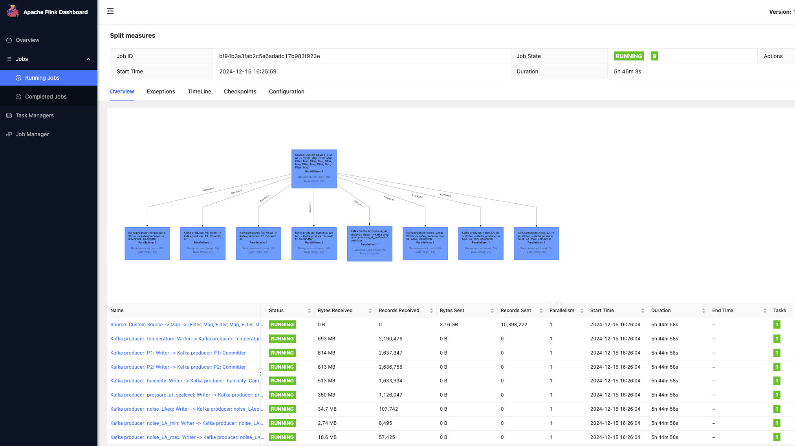
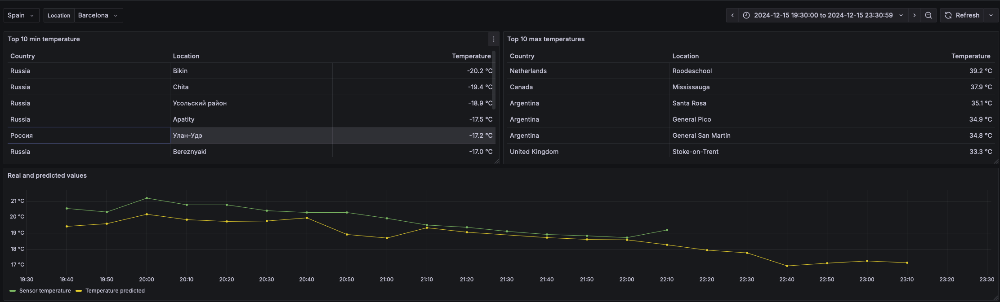
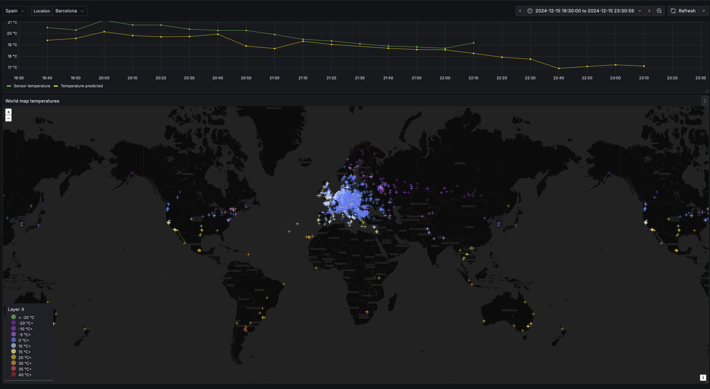
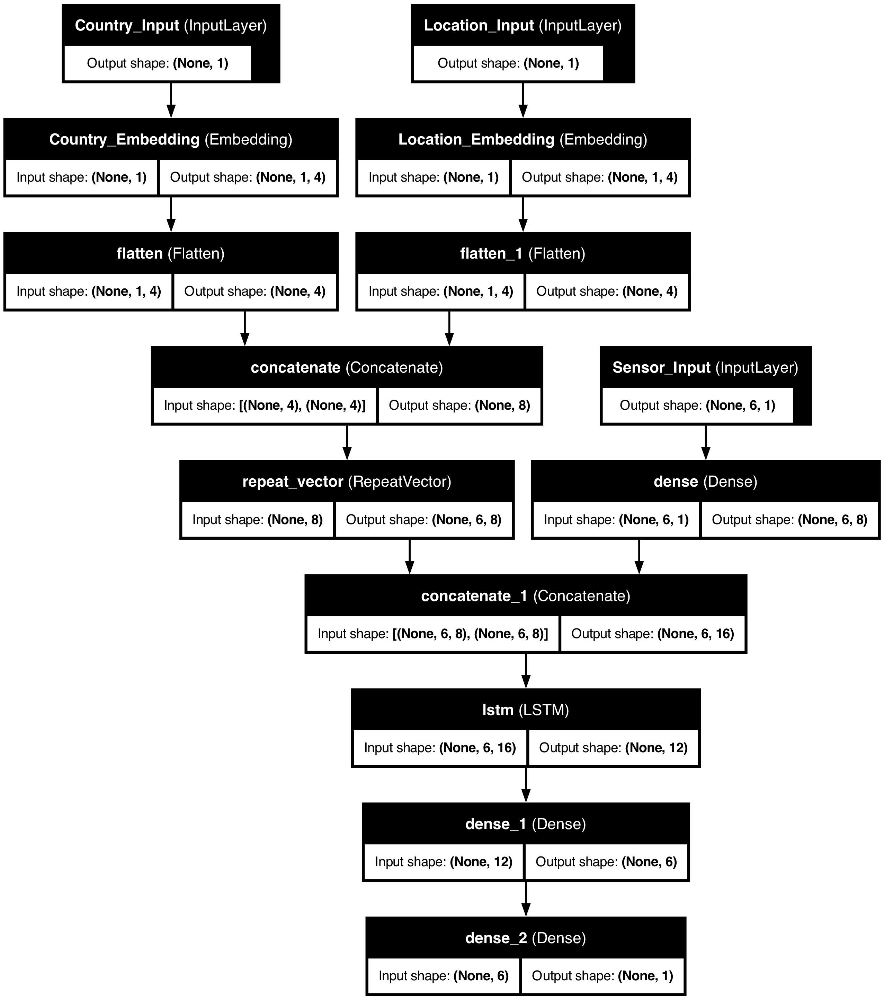

# English

---
# Español

En este repositorio se encuentra el proyecto final de master realizado por Raúl García Díaz ([raulgd@uoc.edu](mailto:raulgd@uoc.edu)).

## Introducción

La solución presentada trata sobre un caso practico de procesamiento de datos a tiempo real. Para ello se ha hecho uso de diferentes tecnologías:

- Redis: base de datos para tener en cache valores frecuentemente solicitados.
- Kafka: cola de mensajería, para el intercambio de mensajes a tiempo real.
- Flink: corazón del procesamiento de datos. Se encarga de realizar todo el procesado de los datos.ç
- InfluxDB: base de datos de series temporales. Ideal para el caso de uso de este proyecto.
- Grafana: aplicación para visualizar datos a tiempo real con dashboard customs.
- Kubernetes: plataforma donde se se ha desplegado el proyecto. Para un despliegue sencillo se ha hecho uso de **minikube**.
- Docker: solución de contenedor que se ha optado por usar debido a su uso tan amplio en la industria.

Por otro lado se han desarrollado aplicaciones para poder culminar con el proyecto:

- scraper: Aplicación desarrollada en python para obtener la información y enviarla en crudo a kafka.
- Collector: Flink no tiene una integración nativa con influxDB (conocidos como sinks), por lo que tuve que desarrollar un collector encargado de enviar los datos desde la cola de kafka con los datos procesado a influxDB.
- model-RNN: Código desarrollado en python para la creación de los modelos para la posterior predicción de los valores  de los sensores a futuro.
- app-predict: Aplicación que se encarga de cargar el modelo correspondiente al tipo de valor que se vaya a predecir para asi poder realizar una predicción y guardar esa predicción en influxDB.

## Tecnologías usadas

### Redis

Redis es una base de datos *key-value*, que principalmente se conoce por su alta velocidad. Es fácil de desplegar y configurar. El caso de uso que se le ha dado es para cachear las localizaciones de los sensores, para asi no desbordar la api que me permite realizar una búsqueda inversa a traves de las coordenadas de los sensores.

También he guardado aquí los diccionarios con los países y localizaciones que se han usado a la hora de entrenar cada uno de los modelos, para si tenerlos también en las aplicaciones de predicción.

### Apache Kafka

Kafka es una plataforma distribuida para guardar eventos. Se ha escogido esta debido a su popularidad y su rendimiento. El caso de uso en este proyecto ha sido para guardar los datos obtenidos por el scraper en un topic y también los datos procesados por flink; un topic por cada uno de los tipos de sensores.

### Apache Flink

Como framework de procesamiento de datos a tiempo real se ha escogido flink debido a los resultado positivo que ofrece procesando datos y a la facilidad que tiene para escalarlo en caso de necesidad. En este proyecto solamente se ha creado un job que se encarga de filtrar outlier de los valores de los sensores y clasificarlos en función del tipo de sensor del que se trata: temperatura, humedad, presión, partículas y ruido.

### InfluxDB

InfluxDB se ha escogido debido a ser una base de datos para series temporales popular y de buen redimiendo. En este proyecto, InfluxDB es muy util debido a que al final, lo que se va ha guardar va a ser series temporales por lo que tiene sentido usar esta base de datos y no postgreSQL u otras bases de datos conocidas.

### Grafana

Plataforma que proporciona numerosas herramientas para mostrar datos a tiempo real. Para el caso de uso de este proyecto ha sido ideal debido al abanico de posibilidades que proporciona grafana, entre otras, poder pintar series temporales y dibujar puntos en un mapa del mundo.

### Kubernetes

Muchas de las aplicaciones mencionadas anteriormente escalan muy bien de forma horizontal, y en proyectos grandes de procesado de datos seria necesario tener esta posibilidad. Kubernetes facilita esta tarea debido a la orquestación que te permite realizar y la abstracción que te ofrece. En este caso de uso, debido a que es una demo y mi portátil no tiene infinitos recursos (no como un CPD), he desplegado un cluster de kuberentes con solamente una maquina virtual.

### Docker

Para los contenedores de las aplicaciones, se ha usado docker. Existen otras plataformas para crear contenedores, como rocket, pero se ha usado docker debido a ya el conocimiento que se tenia.

## Aplicaciones desarrolladas

### scraper

Se trata de una aplicación desarrollada en python para obtener los datos de [sensor.community](https://sensor.community/), realizar una búsqueda inversa para asi obtener la ciudad, pueblo o estado (si lo hay), y posteriormente enviarlo a kafka.

### Collector

Esta aplicación se ha desarrollado debido a que flink no tiene ningún "sumidero" para influxdb. Lo ideal en esto casos hubiera sido crear uno simple a traves de las herramientas que ofrece flink pero debido a mis escasos conocimientos en java, he tenido que desarrollar la aplicación de collector. Esta aplicación coge los valores  que escribe flink en kafka y los envía a influxDB.

### modelo-RNN

Script que su único propósito es crear los modelos de las RNN para que posteriormente se usara por la aplicación "app-predict". Lo ideal hubiera sido automatizarlo con el framework de kube-flow y sus pipelines que ofrece con kserve pero debido al escaso tiempo no se ha podido completar.

### app-predict

Cada 10 minutos se ejecuta esta aplicación para realizar las predicciones a traves de los datos que se ha recolectado para posteriormente escribir los datos en influxDB.


## Evidencias

Estado de los pods del cluster
```shell
$ kubectl get pods                                                                                                                                                                                                                                            ok | 23m 27s | lab py | minikube kube 
NAME                                          READY   STATUS      RESTARTS          AGE
collector-raw-data-6bdd8bc6b7-8c96r           1/1     Running     3 (2d8h ago)      6d6h
flink-kubernetes-operator-694976d45-lvlg6     2/2     Running     0                 6h23m
my-cluster-broker-0                           1/1     Running     12 (2d8h ago)     16d
my-cluster-broker-1                           1/1     Running     12 (2d8h ago)     16d
my-cluster-broker-2                           1/1     Running     12 (2d8h ago)     16d
my-cluster-controller-3                       1/1     Running     11 (2d8h ago)     16d
my-cluster-controller-4                       1/1     Running     12 (2d8h ago)     16d
my-cluster-controller-5                       1/1     Running     12 (2d8h ago)     16d
my-cluster-entity-operator-7f9cc787-cms6t     2/2     Running     51 (2d8h ago)     16d
my-grafana-565bb8b9bc-4465x                   1/1     Running     10 (2d8h ago)     15d
my-influxdb-influxdb2-0                       1/1     Running     16 (2d8h ago)     20d
my-redis-master-0                             1/1     Running     10 (2d8h ago)     13d
my-redis-replicas-0                           1/1     Running     16 (2d8h ago)     13d
my-redis-replicas-1                           1/1     Running     17 (2d8h ago)     13d
my-redis-replicas-2                           1/1     Running     16 (2d8h ago)     13d
predict-humidity-28904875-rgbrx               0/1     Completed   0                 24m
predict-humidity-28904885-bdjzt               0/1     Completed   0                 14m
predict-humidity-28904895-2wk4p               0/1     Completed   0                 4m18s
predict-noise-la-max-28904875-j7whj           0/1     Completed   0                 24m
predict-noise-la-max-28904885-cgx9p           0/1     Completed   0                 14m
predict-noise-la-max-28904895-9hs2g           0/1     Completed   0                 4m18s
predict-noise-la-min-28904875-q9tb7           0/1     Completed   0                 24m
predict-noise-la-min-28904885-b4bp4           0/1     Completed   0                 14m
predict-noise-la-min-28904895-7vkdj           0/1     Completed   0                 4m18s
predict-noise-laeq-28904875-497pj             0/1     Completed   0                 24m
predict-noise-laeq-28904885-57wcw             0/1     Completed   0                 14m
predict-noise-laeq-28904895-6zfrt             0/1     Completed   0                 4m18s
predict-p1-28904875-l2hwm                     0/1     Completed   0                 24m
predict-p1-28904885-bm445                     0/1     Completed   0                 14m
predict-p1-28904895-n2dw7                     0/1     Completed   0                 4m18s
predict-p2-28904875-m99vz                     0/1     Completed   0                 24m
predict-p2-28904885-s48ws                     0/1     Completed   0                 14m
predict-p2-28904895-2rfwb                     0/1     Completed   0                 4m18s
predict-pressure-at-sealevel-28904875-6qx57   0/1     Completed   0                 24m
predict-pressure-at-sealevel-28904885-x5lkn   0/1     Completed   0                 14m
predict-pressure-at-sealevel-28904895-s2zrl   0/1     Completed   0                 4m18s
predict-temperature-28904875-ckxvd            0/1     Completed   0                 24m
predict-temperature-28904885-wlrcv            0/1     Completed   0                 14m
predict-temperature-28904895-lq2qn            0/1     Completed   0                 4m18s
pyflink-split-measures-79c5fcfbdc-6qcbr       1/1     Running     0                 4h53m
pyflink-split-measures-taskmanager-1-1        1/1     Running     0                 4h53m
sensor-scapper-28904870-k2fqf                 0/1     Completed   0                 29m
sensor-scapper-28904880-m7zgk                 0/1     Completed   0                 19m
sensor-scapper-28904890-kjqgb                 0/1     Completed   0                 9m18s
strimzi-cluster-operator-7cf9ff5686-nc7nb     1/1     Running     271 (5h44m ago)   16d
```

Dashboard de Flink


Dashboard de grafana para las temperaturas. Parte 1.


Dashboard de grafana para las temperaturas. Parte 2.


Modelo usado.



